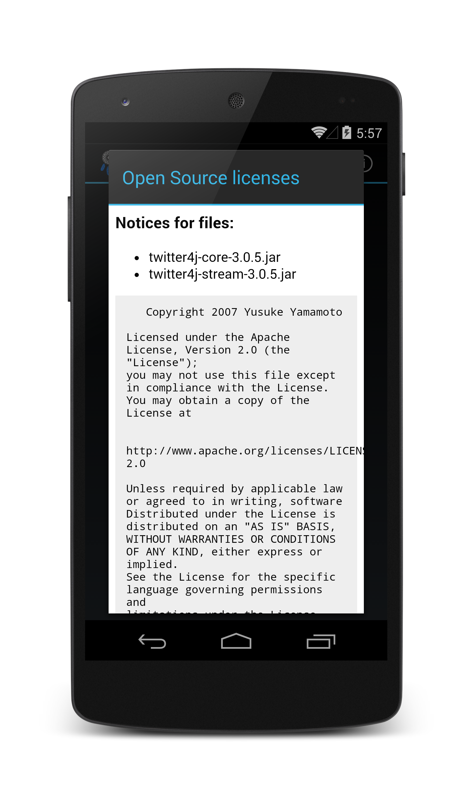

Android Licenses Page
============
This repository contains an example of how to produce a licenses page for an Android app similar to the ones found in Google apps such as Play Music and Gmail.



## Usage

You need to include the following files:
- `LicensesFragment.java` in your projects source
- `/res/layout/licenses_fragment.xml` layout file 
- `/res/raw/licenses.html` licenses file

You will need to update the namespace of `LicensesFragment`, and you may as well check out the other TODOs while you're there - things like removing the support library references if you aren't using it, and extracting the dialog title out to your strings file.

To display licenses for your app, you need to update the `licenses.html` file to suit (including any libraries you've used, their licenses, copyrights, and any links to source you may have modified, if required), then you can display it as follows:

```java
LicensesFragment.displayLicensesFragment(getSupportFragmentManager());
```

You can also display it yourself as you would any other [DialogFragment](http://developer.android.com/reference/android/app/DialogFragment.html).

If you clone the repository, you should be able to open the included AndroidLicensesPageExampleProject in Android Studio and run it directly on any device running Android 2.1 or higher.

## License

    Copyright 2013 Adam Speakman

    Licensed under the Apache License, Version 2.0 (the "License");
    you may not use this file except in compliance with the License.
    You may obtain a copy of the License at

       http://www.apache.org/licenses/LICENSE-2.0

    Unless required by applicable law or agreed to in writing, software
    distributed under the License is distributed on an "AS IS" BASIS,
    WITHOUT WARRANTIES OR CONDITIONS OF ANY KIND, either express or implied.
    See the License for the specific language governing permissions and
    limitations under the License.
